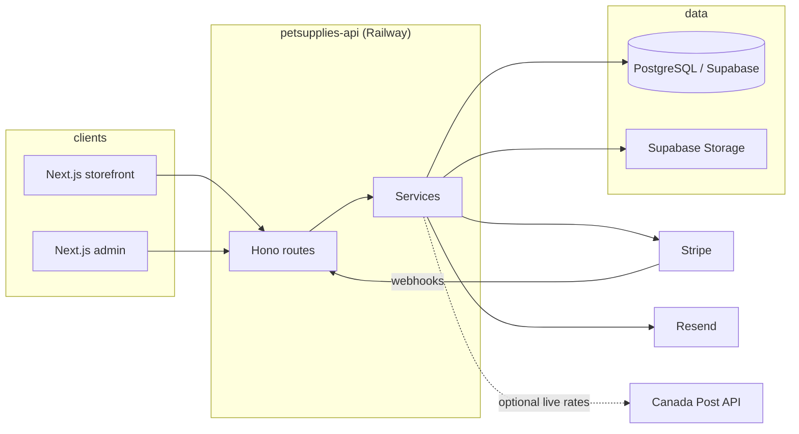

# petsupplies-api

Hey — you're looking at the backend for a real, live pet-supplies shop. A friend had one ask: _"I want a website for my new business idea."_ I wanted to see if I could take that loose idea, flesh it out with what I've picked up along the way (BitGo, other internships), and ship it as fast as I could with AI — storefront, admin console, the works. This repo is the **REST API** half of that platform. The customer-facing site and admin UI live in a separate Next.js frontend that talks to these endpoints.

---

## What you get

| Surface            | Who uses it                                | What it does                                                                                                                 |
| ------------------ | ------------------------------------------ | ---------------------------------------------------------------------------------------------------------------------------- |
| **Storefront API** | Next.js app (public + logged-in customers) | Catalog, cart, checkout, orders, reviews, wishlist, addresses, pets, subscriptions, shipping quotes, site settings for ISR   |
| **Admin API**      | Next.js admin console                      | Product CRUD & images, order fulfillment, discounts, analytics, customers, site settings (nav, hero, pages, email templates) |
| **Webhooks**       | Stripe only                                | Payment completion, subscription lifecycle, idempotent order state + stock                                                   |
| **Jobs**           | Railway cron / GitHub Actions              | Abandoned-cart email, upcoming delivery reminders, back-in-stock alerts                                                      |

Money is stored in **cents** (`Int`). Auth is **Supabase JWT**; the API verifies tokens and loads roles from Postgres — it does not create users on login (a Supabase DB trigger mirrors `auth.users` → `public."User"`).

---

## Stack

| Layer      | Choice                                               |
| ---------- | ---------------------------------------------------- |
| Runtime    | Node.js 20 LTS, TypeScript (strict)                  |
| HTTP       | [Hono](https://hono.dev/)                            |
| ORM        | Prisma 7 + `@prisma/adapter-pg`                      |
| Database   | PostgreSQL (Supabase in prod/staging)                |
| Auth       | Supabase Auth (JWT verification in middleware)       |
| Payments   | Stripe Checkout + webhooks                           |
| Email      | Resend (transactional templates editable in admin)   |
| Validation | Zod                                                  |
| Tests      | Vitest, Supertest, and Hono's built-in `app.request` |
| Hosting    | Railway (Docker), auto-migrate on container boot     |

---

## Architecture (high level)



**Code layout**

- `src/routes/` — thin HTTP handlers
- `src/services/` — business logic (testable)
- `src/middleware/` — auth, `adminOnly`, errors, logging, cron auth
- `src/lib/` — Prisma, Stripe, Supabase clients
- `prisma/` — schema, migrations, seed
- `supabase/triggers/` — SQL applied manually in Supabase (not Prisma migrations)
- `docs/` — feature runbooks and the canonical route list

---

## Design decisions (why it works this way)

These are intentional — not MVP shortcuts waiting to be "fixed later."

### Server-side cart

One cart per user in Postgres, not localStorage. Supports cross-device carts and abandoned-cart emails without trusting the browser.

### Checkout and stock (Stripe-recommended)

1. **Cart mutations** validate stock but never decrement it.
2. **`POST /checkout/session`** creates an `Order` in `PENDING`, clears the cart in the same transaction, and opens Stripe Checkout.
3. **`POST /webhooks/stripe`** idempotently moves `PENDING → PAID` and decrements stock inside a single `prisma.$transaction`, using `updateMany({ where: { stock: { gte: quantity } } })` per line so oversell aborts the transaction and cancels the order.
4. **Admin `PAID → CANCELLED`** restores stock.

No ghost inventory holds from abandoned checkouts.

### Auth without API user upserts

Middleware only verifies the JWT and sets `userId`. New signups are synced by `supabase/triggers/sync_auth_user.sql` in each Supabase project. Admin access: `User.role === ADMIN` in DB; first `/admin/*` request can promote from JWT `app_metadata.role` (not `user_metadata`).

### Webhook raw body

`/webhooks/stripe` is mounted **before** any JSON body parser so Stripe signature verification sees the unparsed body.

### Self-serve site content

Public `GET /site/*` endpoints expose settings, nav, featured products, category strip, and static pages for Next.js ISR. Admin `PATCH`/`PUT` under `/admin/site/*` can trigger on-demand revalidation on the frontend when `INTERNAL_REVALIDATE_TOKEN` is set.

### Prisma 7

Connection URL lives in `prisma.config.ts`, not `schema.prisma`. The client is constructed with `PrismaPg` + a `pg` `Pool` (same in seed and runtime).

---

## Features (API surface)

- **Catalog** — products, categories, full-text search vector, tags, reviews with aggregates
- **Cart & discounts** — upsert line items, percentage/fixed/free-shipping codes (Stripe coupons where applicable)
- **Checkout & shipping** — Stripe Checkout; flat/free thresholds from `SiteSettings`; optional Canada Post live quotes with fallback
- **Orders** — customer history; admin status, tracking, fulfillment queue
- **Subscribe & Save** — recurring Stripe subscriptions tied to products and optional pet profiles
- **Wishlist & back-in-stock alerts** — cron-driven notification jobs
- **Pets** — customer pet profiles (subscriptions can reference a pet)
- **Admin** — product images (Supabase Storage), analytics dashboard, per-customer order and subscription detail, email templates (Mustache-style variables)
- **Email** — order confirmation, shipping, abandoned cart, etc. via Resend

Full route inventory: [`docs/api-endpoints.md`](docs/api-endpoints.md).

---

## Local development

**Prerequisites:** Node 20, pnpm 10, PostgreSQL (local or Supabase dev URL).

```bash
pnpm install
cp .env.example .env   # fill DATABASE_URL, Supabase, Stripe test keys, etc.
pnpm exec prisma migrate deploy
pnpm db:seed           # optional sample data
pnpm dev               # http://localhost:3001 (default PORT from .env)
```

For authenticated routes locally, mint a test JWT via Supabase or use the helpers in `tests/helpers/jwt.ts` (same pattern as the test suite).

| Command           | Purpose                      |
| ----------------- | ---------------------------- |
| `pnpm dev`        | Dev server with watch        |
| `pnpm build`      | Compile to `dist/`           |
| `pnpm start`      | Run production build         |
| `pnpm type-check` | `tsc --noEmit`               |
| `pnpm lint`       | ESLint                       |
| `pnpm test`       | Vitest + coverage thresholds |
| `pnpm db:migrate` | `prisma migrate dev`         |
| `pnpm db:studio`  | Prisma Studio                |

Before committing: `pnpm type-check && pnpm lint && pnpm test` (Husky runs lint-staged; commit messages use Conventional Commits).

---

## Testing

- **Unit** — `tests/unit/` (mocked DB/services)
- **Integration** — `tests/integration/` (routing, validation, real Stripe webhook signature verification with mocked handlers)
- **E2E** — `tests/e2e/` (needs migrated Postgres at `DATABASE_URL`)

See [`docs/testing.md`](docs/testing.md). CI runs Postgres 16, applies migrations, then the full suite on every push.

---

## Deployment

Production and staging run on **Railway** from the repo-root `Dockerfile`:

- `staging` branch → staging service (Stripe test, staging Supabase)
- `main` branch → production (Stripe live, prod Supabase)

The container runs `pnpm exec prisma migrate deploy && node dist/index.js` on every boot. One-time Supabase setup (auth sync trigger, Storage buckets, admin SQL) is documented in [`docs/deployment.md`](docs/deployment.md). MVP launch checklist: [`docs/mvp-launch.md`](docs/mvp-launch.md).

---

## Documentation index

| Doc                                                  | Topic                                             |
| ---------------------------------------------------- | ------------------------------------------------- |
| [`docs/api-endpoints.md`](docs/api-endpoints.md)     | All HTTP routes                                   |
| [`docs/deployment.md`](docs/deployment.md)           | Railway, env vars, Stripe webhooks, smoke tests   |
| [`docs/admin-products.md`](docs/admin-products.md)   | Admin catalog & image uploads                     |
| [`docs/admin-dashboard.md`](docs/admin-dashboard.md) | Analytics                                         |
| [`docs/discounts.md`](docs/discounts.md)             | Coupon rules & redemption                         |
| [`docs/subscriptions.md`](docs/subscriptions.md)     | Subscribe & Save                                  |
| [`docs/shipping.md`](docs/shipping.md)               | Quotes & Canada Post                              |
| [`docs/email.md`](docs/email.md)                     | Resend & templates                                |
| [`docs/cron.md`](docs/cron.md)                       | Scheduled jobs                                    |
| [`docs/reviews.md`](docs/reviews.md)                 | Product reviews                                   |
| [`docs/wishlist.md`](docs/wishlist.md)               | Wishlist                                          |
| [`docs/pets.md`](docs/pets.md)                       | Pet profiles                                      |
| [`docs/site-assets.md`](docs/site-assets.md)         | Homepage / site asset bucket                      |
| [`CLAUDE.md`](CLAUDE.md)                             | Contributor/agent conventions (internal patterns) |

---

## Contributing

This project is intended to be open source. Do not commit secrets (use `.env` locally; see `.env.example` for variable names only). Detailed phase plans live in a gitignored `.planning/` folder and are not part of the public repo.

Issues and PRs: [github.com/Derran05W/petsupplies-api](https://github.com/Derran05W/petsupplies-api).

---

## License

ISC (see `package.json`). Frontend repo and live URLs are maintained separately from this API.
